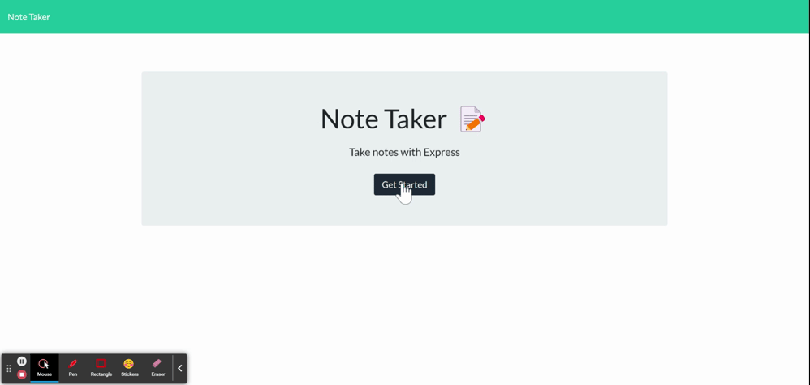

# __Express Note Taker__

## Deployed Link

https://very-generic-note-taker.herokuapp.com/ (Link is current not running)

## Technology

- JavaScript: Programming Language used
- Node.js: To run JavaScript without the browser
    * FileSystem(fs): use to read and write files that are needed
    * path : To find the file needed
- npm: To install necessary modules and packages for this project
- Express.js: for the backend, used to create, read and delete database
- Git: For version control to track changes to source code
- GitHub: To host the repository
- Heroku: To deploy our Website

## Description

Note taking webpage that uses Express.js to Create, Read, Upate, and Delete(CRUD) notes. During this project, I was task with the backend by using the post, get, and delete methods. The starter code was given to me by UC Berkeley Extension.

## Table of Contents

If your README is long, add a table of contents to make it easy for users to find what they need.

- [Installation](#installation)
- [Usage](#usage)
- [Credits](#credits)
- [License](#license)
- [Code Snippets](#code-snippets)
- [Author](#author-links)


## Installation

  Dependencies needed: npm, inquirer, node.js<br>
  Installation : (only follow this installation if this application was downloaded from GitHub)
   - install node.js via (https://nodejs.org/en/download/)
   - In the terminal, do 'npm install' package.json file. Make sure to do this within the directory with index.js.
   - Lastly install inquirer by 'npm i express'. Again, do this within the directory with index.js

## Usage

Instuctions <br>

Adding Notes:
1) Click on "Get Started
2) Click on "Note Title" and give it a title
3) Do the same with "Note Text"
4) Click the save button. The note should appear on the left-hand side.
<br>

Show Notes: Click on the title on the left-hand side the note should appear again.<br>

Delete Notes: Click on the read Trash Can to delete the note you want.<br>





## Credits

The start code was provided by UC Berkeley Extension. I was task with the server.js

## License

N/A

## Features

If your project has a lot of features, list them here.

## Code Snippets

```js
//to save the note currently being worked on
app.post('/api/notes', (req, res) => {
    //gets the db.json from the filepath and then make it into an array/object
    const noteArr = JSON.parse(fs.readFileSync(filePath, "utf-8"));
    //variable for the newNote
    const {title, text} = req.body;
    //creating an element of the db.json array
    const newNote = {
        title,
        text,
        id : (noteArr.length),
    };

    //add newNote to the noteArr, which is also the db.json
    noteArr.push(newNote);

    //writeFile to db.json
    fs.writeFileSync(filePath, JSON.stringify(noteArr));
    //this is the response 
    res.json(noteArr);
});

```

The code above saves the new note with its given information into the db.json file.


```js
//to delete notes
app.delete('/api/notes/:id', (req,res) => {
    //get the id from the parameters
    const id = req.params.id;
    //parse the data from note db.json
    let noteArr = JSON.parse(fs.readFileSync(filePath, "utf-8"));

    //use the array funciton filter to get rid of the id that needed to be deleted
    noteArr = noteArr.filter((note) => note.id != id)
    //need to make new id after deleting
    for(let i=0; i<noteArr.length; i++){
        noteArr[i].id = i;
    }

    //write the file to db.json
    fs.writeFileSync(filePath, JSON.stringify(noteArr));
    //this is the response 
    res.json(noteArr);
    
});

```

This function delete notes from db.json when we click the delete button


## Author Links

  You can reach me on
  GitHub: [__chanjeff520__](https://github.com/chanjeff520) <br>
  LinkedIn: [__Jeff chan__](https://www.linkedin.com/in/jefflchan/),<br>
  Email:  __chanjeff520@gmail.com__
